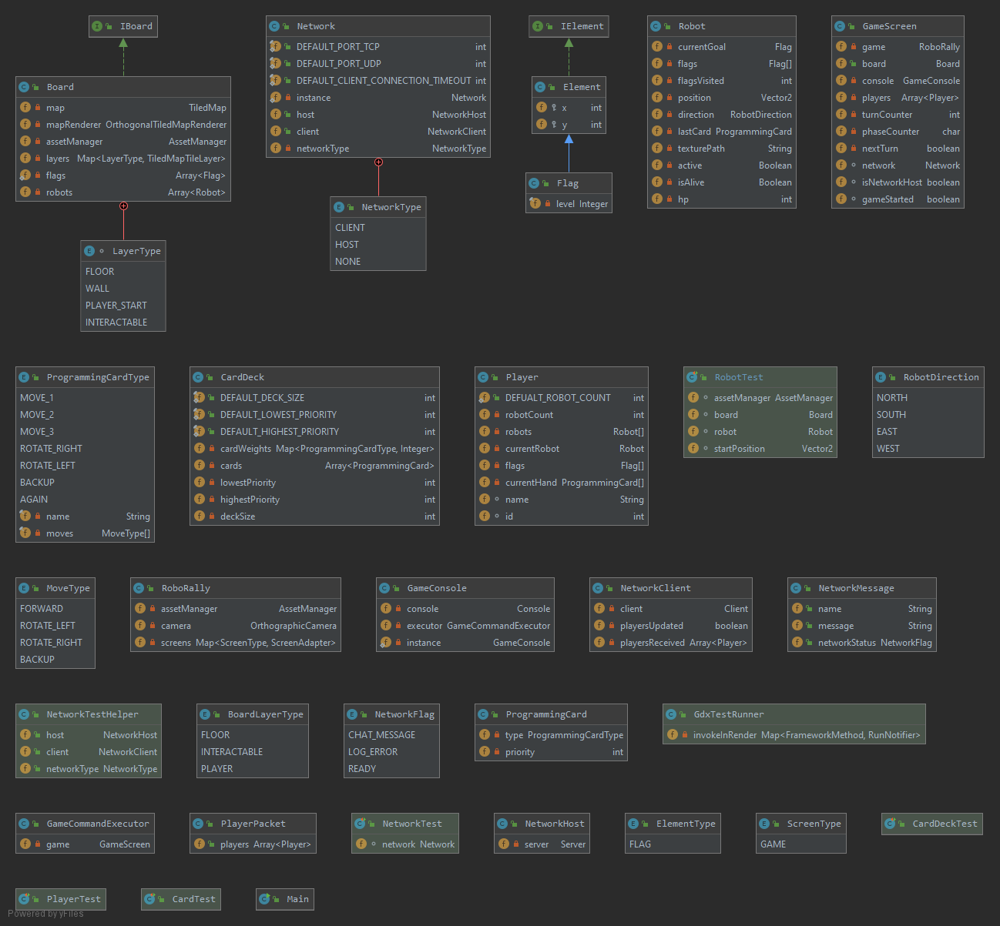

# INF112 Ingenting Roborally  

Digital implementation of the classic board game Roborally.

### Participants:
- Ayoub Tammoui
- Sigurd Aleksander Sagstad
- Ørjan Skårnes
- Jakob Snorrason

## Deliverables
-   [Obligatorisk oppgave 1](Deliverables/ObligatoriskOppgave1.md)
-   [Obligatorisk oppgave 2](Deliverables/Oblig2.md)
-   [Obligatorisk oppgave 3](Deliverables/Oblig3.md)
-   [Obligatorisk oppgave 4](Deliverables/Oblig4.md)

## How to run
1. Clone the repo from github to you computer then
2. Open project in IntelliJ Community Edition or other editors that supports Java Maven projects.
3. Download dependencies and build project.
4. After compiling, the game will launch

## UML

